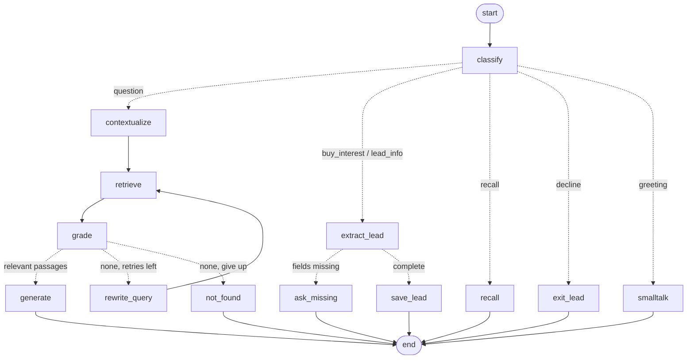

# Case 2 – InsureX Sales Assistant (Advanced RAG with LangGraph)

An AI agent (with a React web chat) that helps InsureX sales agents answer customer questions from the product knowledge base (5 PDFs),
**captures leads** through an **MCP tool** when a customer shows interest, and **remembers each conversation per
session**. Everything runs **locally**: the LLM and embeddings are served by **Ollama**.

| Requirement | Implementation |
|---|---|
| Framework | LangChain + **LangGraph** state machine (12 nodes, conditional routing, retrieval **cycle**) |
| Vector DB | **FAISS** (cosine similarity, persisted to `data/faiss_index/`) |
| Knowledge base | 5 InsureX category PDFs in `knowledge_base/` (mostly Thai) → read with PyMuPDF → chunked (1000 chars, 150 overlap), each chunk labelled "document › product section" → embedded with `bge-m3` (multilingual: Thai ⇄ English) |
| Not-found handling | relevance floor + LLM grader → query rewrite → retry → polite fallback (never invents an answer) |
| **Bonus 1** – lead collection | interest triggers `lead_collection` mode; name, occupation, income and phone are extracted into a **Pydantic** model over several turns, validated, and saved to **SQLite** via an **MCP server** (`save_lead`, `list_leads`) |
| **Bonus 2** – sessions | LangGraph **SQLite checkpointer**, `thread_id = session_id`: separate memory per user that survives restarts; recent window plus a **running summary** of older messages (`update_memory` node); chats can be listed, renamed and deleted |

**Knowledge base** (folder set by `KNOWLEDGE_DIR`, default `knowledge_base/`):

| PDF | Content |
|---|---|
| `InsureX_Health_Insurance.pdf` | 7 health products (Easy E-Health, E-Health Mini, HB Plus, คุ้มตลอดชีพ พลัส, คุ้มรักษาเหมาจ่าย เอ็กซ์ตร้า and its kids version, Prima Care) with benefit tables |
| `InsureX_Accident_Insurance.pdf` | 38 personal accident plans from 4 insurers (ทิพย, ไทยวิวัฒน์, วิริยะ, เทเวศ) for kids, working age and seniors |
| `InsureX_Savings_Insurance.pdf` | 3 savings plans (Easy E-Save 10/3, คุ้มมั่งมี 18/9, คุ้มออมสุข) |
| `InsureX_Travel_Insurance.pdf` | travel insurance: cover, optional extras, 28 FAQ answers |
| `InsureX_Pet_Insurance.pdf` | TIP Pet Lover: plans S–XXL, conditions, exclusions, FAQ |

Each PDF was generated from insurex.co.th: the product data in the category page plus the partner product pages it
links to. Pages that build their content in the browser were rendered with Playwright (Edge), clicking "show more"
and opening every FAQ answer. Reading them needed three fixes in `PdfLoader`: PyMuPDF instead of pypdf (pypdf dropped
Thai tone marks and upper vowels), joining text that shares a baseline so table rows stay on one line, and labelling
every chunk with its document title and current section heading, so a benefit table is tied to the right product.
Legacy Thai Private Use Area glyphs (U+F700–U+F71A) are also mapped to standard Thai. To change documents, replace
the PDFs and run `python main.py ingest`.

---

## 1. Setup

**Prerequisites:** Python 3.10+ (developed on 3.12) and [Ollama](https://ollama.com).

```bash
# 1. models (local)
ollama pull qwen3:14b      # chat model with tool calling (~9 GB; a GPU with 12 GB VRAM is ideal)
ollama pull bge-m3         # multilingual embedding model (~1.2 GB)

# 2. Python environment
python -m venv .venv
.venv\Scripts\activate            # Windows   (Linux/macOS: source .venv/bin/activate)
pip install -r requirements.txt

# 3. build the vector index from the PDFs in KNOWLEDGE_DIR (default knowledge_base/)
python main.py ingest
```
To use smaller models, set `CHAT_MODEL` / `EMBED_MODEL` (see `.env.example`).

## 2. Usage

### Web chatbot (React + Node.js frontend)
```bash
python main.py serve                  # → open http://127.0.0.1:8000   (or double-click start_chatbot.bat)
```
The UI is a **React 19 + TypeScript** app built with **Node.js / Vite** (`frontend/`). The compiled build is in
`frontend/dist`, so the app runs without Node; FastAPI serves it.
```bash
cd frontend && npm install            # only needed to change the UI
npm run dev                           # hot-reload dev server on :5173 (proxies /api to :8000)
npm run build                         # type-check + production build → frontend/dist
```
- **Streaming answers**: tokens appear as they are generated, and the **agent pipeline** panel lights up each LangGraph node live (including the retry loop)
- **Chats with memory**: every chat is a separate LangGraph thread kept on the server, with an auto title, search and **rename**. Reopen any chat and the conversation continues. **Delete** removes the chat and erases its memory (saved leads are kept as business records)
- **Long-term memory per chat**: after 12+ messages, older ones are folded into a running summary (shown in the *Session memory* card), so long chats are still remembered without sending everything to the LLM
- **Lead capture**: badge, progress ring and field checklist; toast and saved-leads list via the MCP `list_leads` tool
- Source chips for citations, per-message step trace, dark/light theme, mobile layout. The older no-build UI is at `/classic`
- API: `POST /api/chat`, `POST /api/chat/stream` (SSE: step / token / final), `GET|PATCH|DELETE /api/sessions/{id}`, `GET /api/sessions`, `GET /api/leads`, `GET /api/health`

### Command line
```bash
python main.py chat --session alice   # interactive chat; each --session has its own memory
python main.py demo                   # scripted demo → logs/demo_run.log + logs/demo_transcript.md
python main.py eval                   # RAG accuracy test (100 questions) → logs/eval_report.md
python main.py leads                  # list captured leads (through the MCP list_leads tool)
python main.py graph                  # print the LangGraph structure (Mermaid)
python main.py present                # presenter direction + cheat sheet PDF → output/ (after eval + demo)
python -m pytest -q                   # 36 tests (the integration test is skipped if Ollama is off)
```
In chat, type `history` to see what the session remembers and `exit` to quit. Run `chat --session alice` again
later and the conversation continues where it stopped.

### The MCP lead tool
`src/sales_agent/mcp_server.py` is a standard **Model Context Protocol** server (FastMCP, stdio transport) with two tools:

| Tool | Arguments | Returns |
|---|---|---|
| `save_lead` | `name, occupation, monthly_income, phone, session_id, interested_product?` | `{"ok": true, "lead_id": n, "lead": {...}}` or `{"ok": false, "errors": [...]}` |
| `list_leads` | `limit=20` | `{"count": n, "leads": [...]}` |

The agent starts the server as a subprocess and calls it with **langchain-mcp-adapters** (`mcp_client.py`).
Validation (`Lead` Pydantic model) happens **inside the tool**, so any client gets the same data integrity:
names are trimmed, income must be positive, and phones must be valid Thai numbers, normalised to `0XXXXXXXXX`.
Any MCP client can use the server, for example:
```bash
npx @modelcontextprotocol/inspector .venv/Scripts/python -m sales_agent.mcp_server   # with PYTHONPATH=src
```

## 3. LangGraph design



**State** (`AgentState`, checkpointed per session):

| Field | Purpose |
|---|---|
| `messages` | full conversation (`add_messages` reducer) |
| `mode` | `qa` or `lead_collection`: persists across turns, so the agent knows it is collecting details |
| `lead`, `lead_started_at`, `lead_id` | partial `LeadDraft`, built up over several turns |
| `intent`, `interested_product` | router output for the current turn |
| `query`, `attempts`, `documents` | standalone search query, rewrite counter, graded passages |

**Nodes**
| Node | What it does |
|---|---|
| `classify` | LLM router (structured output) picks the intent, using the mode and recent history |
| `contextualize` | rewrites follow-ups into standalone queries using memory ("how much is *it* per month?" → "คุ้มออมสุข เบี้ยประกันรายเดือน"); queries are written in Thai to match the documents |
| `retrieve` | FAISS top-k with a cosine-similarity floor |
| `grade` | LLM keeps only passages that **directly** answer the question; needed because similarity alone cannot detect off-topic questions (off-topic questions still get high cosine scores) |
| `rewrite_query` → `retrieve` | **the cycle**: one alternative query before giving up (`max_query_rewrites`) |
| `generate` | grounded answer with `[file, page]` citations, in the user's language; during lead collection it also reminds the customer what is still missing |
| `not_found` | safe fallback: says the information isn't in the documents |
| `extract_lead` / `ask_missing` / `save_lead` | lead mode: extract → ask for missing fields → MCP `save_lead`; if the tool rejects a field, only that field is asked again |
| `recall` | answers questions about the conversation from **this session's** memory only |
| `update_memory` | runs at the end of every turn; once the chat passes 12 unsummarised messages, folds the older ones into a running summary |
| `exit_lead`, `smalltalk` | leave lead mode politely; greetings |

**Robustness:** structured calls retry, then fall back from tool calling to JSON-schema mode, then to a safe default.
The grader's default is "nothing relevant", so the agent refuses rather than guesses. Any exception in a turn
(including Ollama being down) returns a friendly message and is logged, and the session stays usable.

## 4. Results

**Evaluation** (`python main.py eval`, report in `logs/eval_report.md`): 100 questions written from the 5 PDFs:
85 answerable (24 health, 18 accident, 15 savings, 15 pet, 13 travel; Thai and English; every expected value checked
against the source text) and 15 out of scope (car, home, pension, cyber, and the two products removed from the
knowledge base). Each runs in a fresh session through the full graph. An expected value can list alternatives
(`"3 แสน|300,000"`).

| Metric | Result |
|---|---|
| Overall (correct answers + correct refusals) | **91/100** |
| Answer accuracy (expected fact present in the answer) | **91%** (77/85) |
| Retrieval hit rate (correct document in top 4) | **100%** |
| Out-of-scope questions correctly refused | **93%** (14/15) |

Most misses are reading the wrong column of a plan table or confusing two similarly named plans (e.g. "PA กระดูกหัก
แผน 3" and the seniors' "กระดูกหัก แผน 3"). The one refusal counted as a miss was a correct refusal worded by the model
instead of the standard message. Results vary by about ±1 question between runs.

**Chunk size** (1000 characters, 150 overlap) was chosen by testing, not by rule of thumb; see
`logs/chunk_comparison.md`. A fast retrieval-only sweep over 13 settings found the answer in the top 4 for 81–85
questions at every size, so four candidates ran the full 100-question test: 500/100 → 85, 700/120 → 82,
**1000/150 → 91**, 1200/200 → 89.

**Demo** (`python main.py demo`, see `logs/demo_transcript.md` and `logs/demo_run.log`) shows:
- answers with citations, and follow-up questions resolved from memory
- the retrieve → grade → rewrite → retrieve cycle ending in a safe fallback ("Do you sell car insurance?")
- lead mode with details given over several turns, plus a side question answered mid-collection
- a Thai conversation (a pet plan table, one accident plan among 38), with a full lead captured in one message
- an invalid phone rejected by the MCP tool's validation, then corrected
- session separation (Bob cannot see Alice's chat) and memory surviving a restart
- the final leads table read back through MCP

Typical latency on an RTX 4070 SUPER: 1–2 s for routing and lead turns, 2–6 s for RAG answers.

## 5. Project structure
```
Case2_GenAI_RAG/
├── main.py                      # CLI
├── requirements.txt · .env.example
├── knowledge_base/              # the 5 InsureX category PDFs (not committed, see .gitignore)
├── eval/questions.json          # evaluation set: 85 answerable + 15 out-of-scope questions
├── src/sales_agent/
│   ├── config.py                # Settings (env overridable)
│   ├── knowledge_base.py        # PdfLoader (PyMuPDF, rows, Thai PUA, titles), TextChunker, FaissVectorStore, KnowledgeBase
│   ├── leads.py                 # LeadDraft / Lead (Pydantic), LeadRepository (SQLite)
│   ├── mcp_server.py            # MCP server: save_lead, list_leads
│   ├── mcp_client.py            # LeadToolClient (langchain-mcp-adapters, stdio)
│   ├── prompts.py               # all prompt templates
│   ├── agent.py                 # AgentState, routing functions, SalesAgent (LangGraph)
│   ├── service.py               # SalesAssistant: checkpointer, streaming, sessions, error handling
│   ├── sessions.py              # SessionIndex: server-side chat list (title, dates, turns)
│   ├── web/                     # FastAPI app (app.py) + static chat UI (index.html, app.css, app.js)
│   ├── demo.py · evaluation.py  # DemoRunner, RagEvaluator
│   └── logging_setup.py
├── frontend/                    # React + TypeScript UI (Vite); dist/ = built app served by FastAPI
├── presentation/                # presenter direction + cheat sheet template (python main.py present)
├── output/                      # Case 2 Presenter Direction and Cheat Sheet.pdf
├── tests/                       # 36 pytest tests (unit, MCP over stdio, web API, sessions, integration)
├── logs/                        # demo_run.log, demo_transcript.md, eval_report.md, chunk_comparison.md
└── data/                        # generated: faiss_index/, sessions.db, leads.db
```
